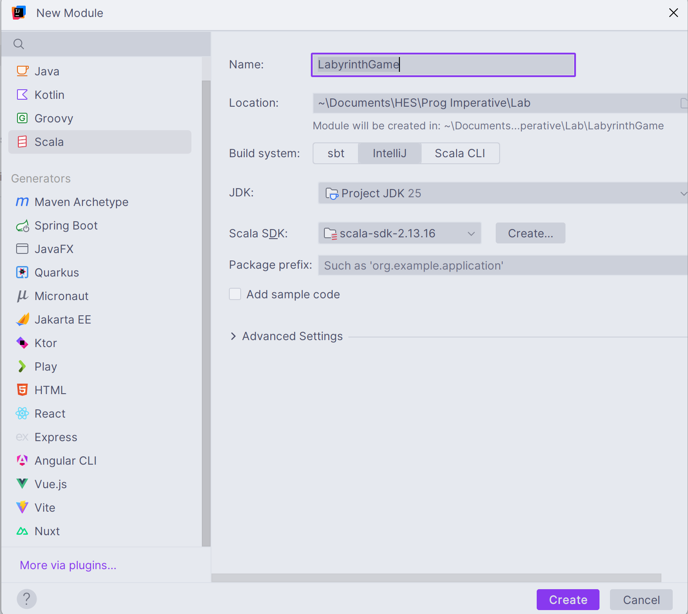

# Introduction
The main constraint of this project is that it has to happen in a 2D Array. A labyrinth game is a great candidate for that kind of game

The game is similar to Tomb of the Mask and other similar games.
    
The player can move only in 1 direction at any given point, and he moves indefinitely while he doesn't hit an obstacle (wall, spike, etc...).

# Overview
The game's array will look like the following:
 ```pseudocode
 [
	 [Wall,  Wall,  Wall,  Wall,  Wall]
	 [Wall,  Space, Space, Wall   Wall],
	 [Wall,  Space, Wall,  Wall,  Wall],
	 [Wall,  Space, Space, Space, Wall],
	 [Wall,  Wall,  Wall,  Wall,  Wall]
 ]
 ```

Each field of the Array will be a game object which contains a certain state. Depending on the state of the field, different things will happen:
* Space : Player is allowed to land on that space and continues his movement
* Wall: Player is not allowed to land on that space, his movement stops

# Diagrams
## Class diagram

This diagram represents the initial structure of game elements. 

**All elements must inherit from the ``GameObject`` abstract class**

# Git workflow
This development of this project is [trunk-based](https://www.atlassian.com/continuous-delivery/continuous-integration/trunk-based-development)

Here are some important branches and their roles:
- ``main`` is the stable branch, which contains prod code. **MERGES ARE DONE ONLY AFTER COMMON AGREEMENT**
- ``dev`` is the **public** development branch on which features, fixes and other changes can be merged by all developers
- other branches (``feat``, ``hotfix``, ``fix``, etc...)

## Git branch management rules
1. Developers should often rebase their branches on the ``dev`` branch to be up to date with other developers
2. When the feature is done, squash commits and note everything that is important into the commit message
3. After rebasing on dev, squashing the commits, you can finally merge your branch into ``dev``
4. Merging into ``main`` is allowed only on agreement with all team members

# Start Working with IntelliJ
1. Clone project and open with IntelliJ Ultimate
2. Go to `File -> Project Structure -> Modules -> + (Add) -> New Module`
3. Set the following Module setting 
4. Right click on `funGraphics-*.jar` and click `Add As Library...`
5. You're all set! Happy coding