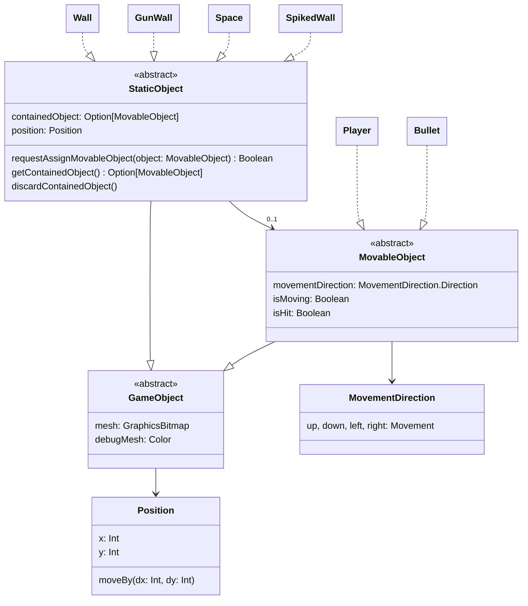

# Introduction
The main constraint of this project is that it has to happen in a 2D Array. A labyrinth game is a great candidate for that kind of game

The game is similar to Tomb of the Mask and other similar games.
    
The player can move only in 1 direction at any given point, and he moves indefinitely while he doesn't hit an obstacle (wall, spike, etc...).

# Overview
## Lore
You play as Pink, a man who has constructed a psychological "wall" of social isolation because of traumatic events of his life.

You, as the player, need to bring light in the empty spaces of the wall to help Pink snap out of it and tear down the Wall.


## How to play
Arrows to move.

The player can only move in a single direction at a time until he collides with something.
* Wall : Basic wall, player can safely collide with it
* Spiked Wall : Kills the player instantly
* Gun Wall : In itself, is a basic wall, the player can collide with it safely. Though the player should be careful, as the gun might shoot fireballs in the direction it's pointed at!

In order to finish the level, all empty spaces must be filled with a path. 
A path is created when the player lands for the first time on an empty space

The game contains 10 levels in total, in order to free Pink, the player needs to complete all 10 of them
# Technical information
## Game
### Array structure
The game's array will look like the following:
 ```pseudocode
 [
	 [Wall,  Wall,  Wall,  Wall,  Wall]
	 [Wall,  Space, Space, Wall   Wall],
	 [Wall,  Space, Wall,  Wall,  Wall],
	 [Wall,  Space, Space, Space, Wall],
	 [Wall,  Wall,  Wall,  Wall,  Wall]
 ]
 ```

Each field of the Array will be a game object which contains a certain state. Depending on the state of the field, different things will happen:
* Space : Player is allowed to land on that space and continues his movement
* Wall: Player is not allowed to land on that space, his movement stops

### Diagrams
#### Class diagram

This diagram represents the initial structure of game elements. 

Main game logic and the entry point is the `Game` object

**All game objects must inherit from the ``GameObject`` abstract class**

### Git workflow
This development of this project is [trunk-based](https://www.atlassian.com/continuous-delivery/continuous-integration/trunk-based-development)

Here are some important branches and their roles:
- ``main`` is the stable branch, which contains prod code. **MERGES ARE DONE ONLY AFTER COMMON AGREEMENT**
- ``dev`` is the **public** development branch on which features, fixes and other changes can be merged by all developers
- other branches (``feat``, ``hotfix``, ``fix``, etc...)

#### Git branch management rules
1. Developers should often rebase their branches on the ``dev`` branch to be up to date with other developers
2. When the feature is done, squash commits and note everything that is important into the commit message
3. After rebasing on dev, squashing the commits, you can finally merge your branch into ``dev``
4. Merging into ``main`` is allowed only on agreement with all team members

# Start Working with IntelliJ
1. Clone project and open with IntelliJ Ultimate
2. Go to `File -> Project Structure -> Modules -> + (Add) -> New Module`
3. Set the following Module setting 
4. Right click on `funGraphics-*.jar` and click `Add As Library...`
5. You're all set! Happy coding

# Run the game 
Go into `Game.scala` file and click `Run`

# LevelBuilder
## Run LevelBuilder
This LevelBuilder is a simple and efficient map editor designed to create levels for the game. Once created and saved, the level will be added to the game.

Go into `LevelBuilder.scala` file and click `Run`

## Guide
1. Select an element by pressing the corresponding key (0-6).
2. Left-click on any grid cell to place the selected element.
3. Press 'y' to validate and save the level creation.

| Key | Element | Description |
| :--- | :--- | :--- |
| **Space** | Space | Empty tile |
| **1** | Wall | Solid block |
| **2** | Spike | Static hazard |
| **3** | Gun Left | Turret shooting left |
| **4** | Gun Right | Turret shooting right |
| **5** | Gun Up | Turret shooting up |
| **6** | Gun Down | Turret shooting down |

# Notice
All the game object meshes were generated using Gemini Nano Banana Pro
