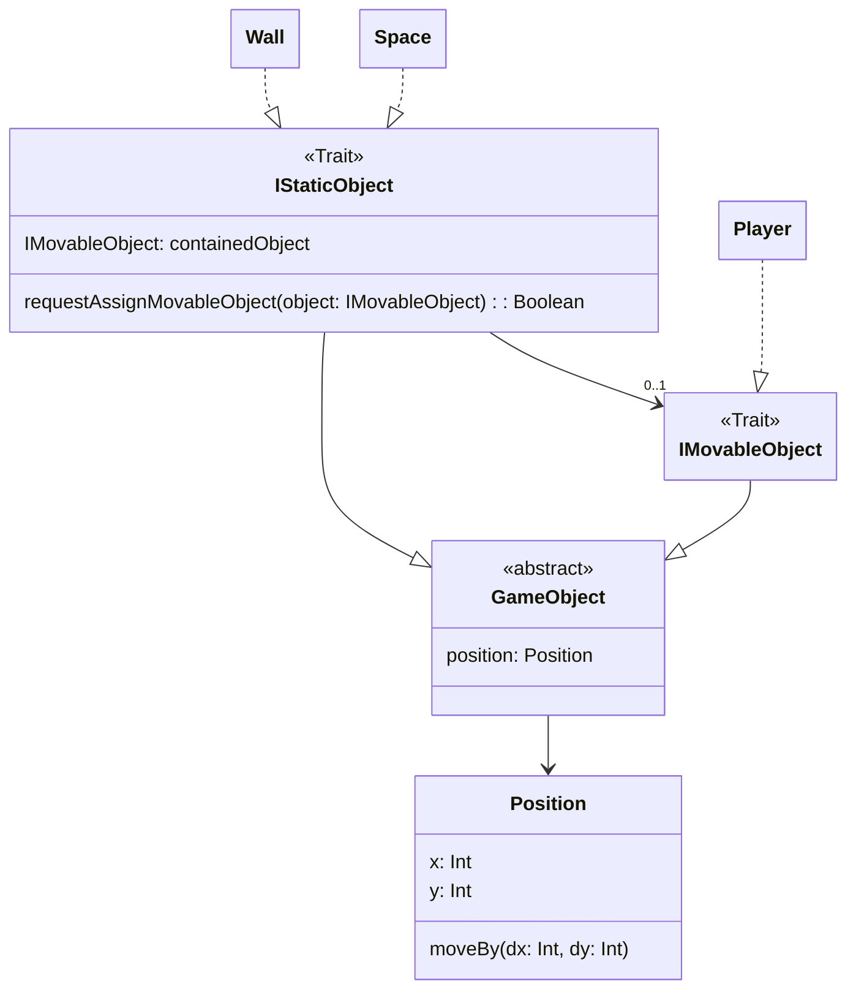

# Introduction
The main constraint of this project is that it has to happen in a 2D Array. A labyrinth game is a great candidate for that kind of game

The game is similar to Tomb of the Mask and other similar games.
    
The player can move only in 1 direction at any given point, and he moves indefinitely while he doesn't hit an obstacle (wall, spike, etc...).

# Overview
The game's array will look like the following:
 ```pseudocode
 [
	 [Wall,  Wall,  Wall,  Wall,  Wall]
	 [Wall,  Space, Space, Wall   Wall],
	 [Wall,  Space, Wall,  Wall,  Wall],
	 [Wall,  Space, Space, Space, Wall],
	 [Wall,  Wall,  Wall,  Wall,  Wall]
 ]
 ```

Each field of the Array will be a game object which contains a certain state. Depending on the state of the field, different things will happen:
* Space : Player is allowed to land on that space and continues his movement
* Wall: Player is not allowed to land on that space, his movement stops
# Class diagram

